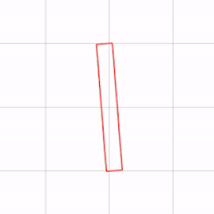
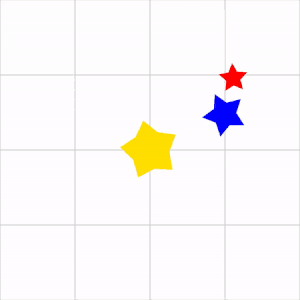
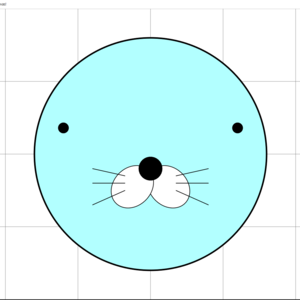
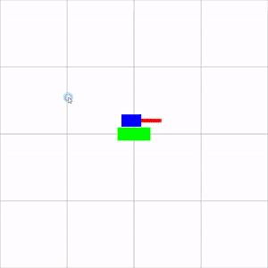
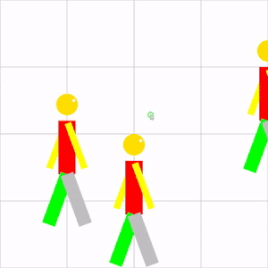
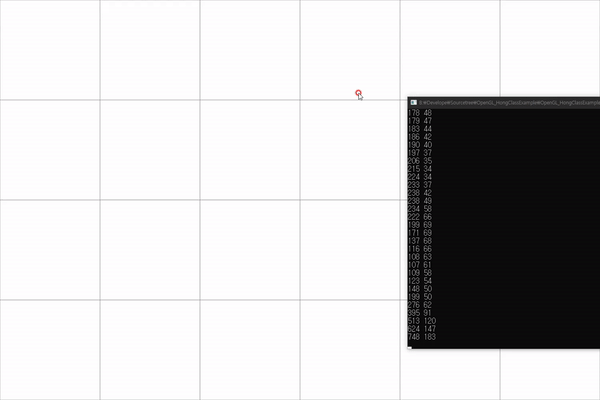
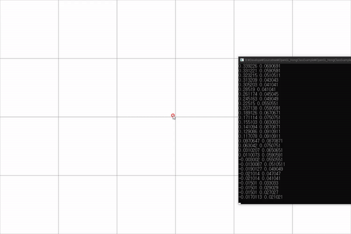
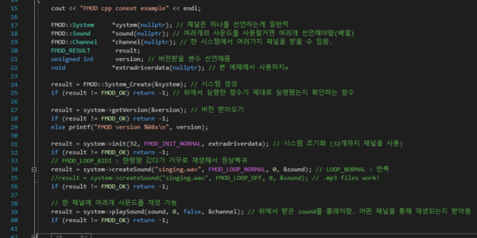

# OpenGL_HongClassExample
홍정모의 게임 만들기 연습 문제 패키지 강좌 실습 내용입니다.
- https://github.com/jmhong-simulation/GameDevPracticePackage

# Chapter1. Hello OpenGL
## Lecture1. 시작하기
### 1. Rotating Star Example

## Lecture2. 이동, 회전, 스케일링, 애니메이션
### 1. Composite Transformation Animation

### 2. Solar System

### 3. Face Example

## Lecture3. 키보드 입력
### 1. Tank Example

### 2. Walking Person

## Lecture4. 마우스 입력
### 1. Window Coordinates

### 2. Screen Coordinates

## Lecture5. FMOD 사운드
### 1. FMOD 라이브러리

---
# Chapter2. 객체지향

## Lecture1. 클래스와 캡슐화
### 1. House

## Lecture2. 상속
### 1. Geometric Object

## Lecture3. 다형성
### 1. Polymorphism

## Lecture4. Factory pattern
### 1.

## Lecture5. Command pattern
### 1.

## Lecture6. Singleton parttern
### 1.

