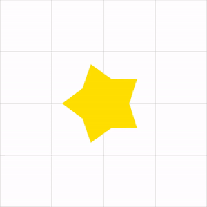

# 🚀OpenGL_HongClassExample
홍정모의 게임 만들기 연습 문제 패키지 강좌 실습 내용입니다.
- https://github.com/jmhong-simulation/GameDevPracticePackage

## ☑ TODO
- [x] TEST
- [ ] TEST2

# 🎨Chapter1. Hello OpenGL
## Lecture1. 시작하기
### 1. Rotating Star Example

## Lecture2. 이동, 회전, 스케일링, 애니메이션
### 1. Composite Transformation Animation

### 2. Solar System

### 3. Face Example

## Lecture3. 키보드 입력
### 1. Tank Example

### 2. Walking Person

## Lecture4. 마우스 입력
### 1. Window Coordinates

### 2. Screen Coordinates

## Lecture5. FMOD 사운드
### 1. FMOD 라이브러리

---
# 🎨Chapter2. 객체지향

## Lecture1. 클래스와 캡슐화
### 1. House

## Lecture2. 상속
### 1. Geometric Object

## Lecture3. 다형성
### 1. Polymorphism

## Lecture4. Factory Pattern
### 1. Factory Pattern

## Lecture5. Command Pattern
### 1. Command Pattern

## Lecture6. Singleton Pattern
### 1. Singleton Pattern

---
# 🎨Chapter3. 물리엔진 기초

## Lecture1. 공 튕기기
### 1. RigidCircle

## Lecture2. 두 공의 충돌
### 1. Collision

## Lecture3. 용수철
### 1. NonSpring System

### 2. Spring System

## Lecture4. 파티클 시스템
### 1. Particle System

---
# 🎨Chapter4. 기타

## Lecture1. 이미지 불러오기
<<<<<<< HEAD
### 1. Image library (stb_image)

